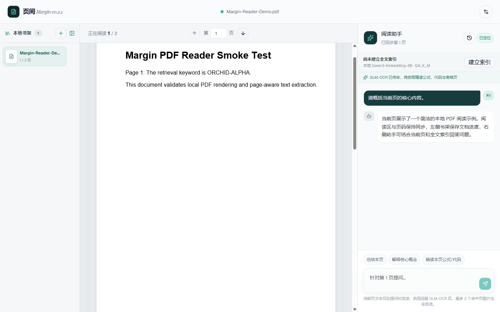
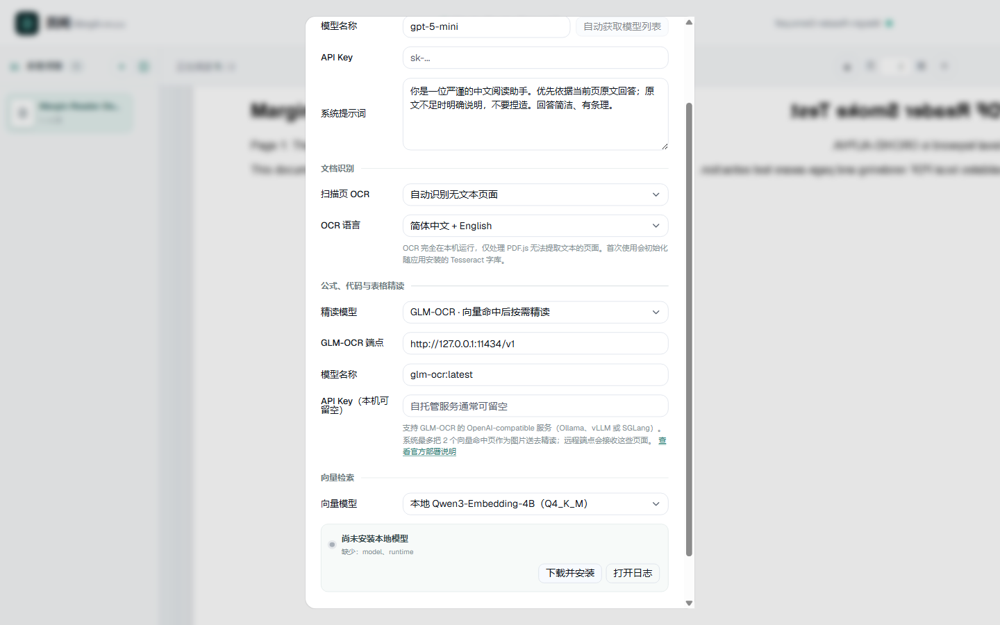
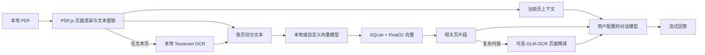

# Margin（页间）

[](https://github.com/Aana11/margin-pdf-reader/actions/workflows/ci.yml)


**Margin 是一个本地优先的 Windows AI PDF 阅读器。**

它把连续阅读、本地书架、阅读进度、页码感知问答和全文向量检索放在同一个桌面界面里。PDF 在本机解析；只有当你主动提问时，当前页文本与检索命中的片段才会发送给你配置的对话模型。



> 截图使用仓库内的演示 PDF 和虚构问答生成，不包含真实文档、账号或 API Key。

## 为什么做 Margin

普通 PDF 阅读器能展示页面，但阅读过程中经常需要反复复制原文、切换聊天窗口、补充页码背景。Margin 让阅读助手始终知道你正在看的页，并可在本机全文索引中补充相关上下文。

- **少切换：** 阅读区、页码导航和 AI 助手同屏工作。
- **有上下文：** 每次提问自动携带当前页原文；建立索引后还能检索全书相关片段。
- **可接续：** 本地书架记录上次阅读页，问答历史按书籍恢复。
- **可控制：** 对话模型、端点、系统提示词和向量模型都由用户选择。
- **本地优先：** PDF、副本、索引、阅读进度和提问历史默认留在本机。

## 核心功能

| 功能 | 说明 |
| --- | --- |
| 连续 PDF 阅读 | 纵向连续滚动、页码跳转、当前页实时同步；远离视口的 Canvas 会释放以降低内存占用。 |
| 本地书架 | 导入的 PDF 保存到应用数据目录，记录阅读进度和对应的向量索引；书架可收纳为最左侧窄栏。 |
| 当前页问答 | 阅读助手自动附带当前页文本，不需要截图或手动复制。 |
| 全文 RAG | 按页提取文本、切分片段、生成向量并进行余弦相似度检索，结果保留原始页码。 |
| GLM-OCR 联动精读 | 向量检索先定位相关页；命中公式、代码、表格或用户明确要求精读时，可选 GLM-OCR 最多复核 2 页并保留 LaTeX/结构。 |
| 提问历史 | 问答按书籍保存在本机，可恢复整段对话并跳回当时提问的页面。 |
| 自定义对话模型 | 支持 OpenAI-compatible `/chat/completions` 端点、模型列表读取、流式回答和自定义系统提示词。 |
| 本地向量模型 | 内置 `Qwen/Qwen3-Embedding-4B` Q4_K_M GGUF，提供 2560 维向量，无需把全文交给远程向量服务。 |
| 模型管理 | 应用内完成空间检查、断点续传、暂停/继续、校验、打开目录、释放内存和卸载。 |
| 本地 OCR | PDF.js 无法提取文字时，自动用 Tesseract.js 识别扫描页；支持简体中文、繁体中文与英文组合，全程不上传图片。 |
| 紧凑索引 | 每本书使用 SQLite 保存元数据与 Float32 二进制向量，旧版 `index.json` 首次打开时自动迁移。 |
| 运行诊断 | 本地主进程与索引流程写入滚动日志，可从模型设置直接打开日志位置。 |

## 界面导览

主界面分为三个区域：

1. **左侧书架：** 导入、打开和移除本地书籍；收起后仅保留 52px 工具栏。
2. **中间阅读区：** 连续展示 PDF 页面，滚动、页码和助手上下文保持同步。
3. **右侧阅读助手：** 建立全文索引、查看历史、使用快捷问题或自由提问。

模型设置支持独立配置对话模型和向量模型。系统提示词会作为每次对话请求的首条 `system` 消息。



## 工作原理



1. PDF.js 从应用管理的本地 URL 按需读取和渲染页面，而不是把整本 PDF 复制进渲染进程。
2. 建立索引时先提取文本；纯图片页会按设置在本机执行 OCR，再按页切分为重叠片段。
3. 内置 Qwen 或自定义 `/embeddings` 端点分批生成向量；每批结果立即写入 SQLite。
4. 向量以 Float32 BLOB 保存。查询时主进程流式扫描数据库并只保留 Top-K，避免反序列化巨大的 JSON 数组。
5. 启用 GLM-OCR 后，系统检测命中片段中的公式、代码、表格或明确的“精读”问题，最多把 2 个候选页交给识别模型复核；结果按页码加入上下文并缓存于当前会话。
6. 命中片段、精读结果与当前页原文只在主动提问时发送给对话端点，回答以 SSE 流式显示。

索引写入使用临时数据库，完成后原子替换；中途点击“停止”不会破坏上一次可用索引。旧版 `index.json` 会在首次打开时自动迁移。大型书籍结果见 [索引性能基准](docs/index-benchmark.md)。

更完整的运行边界和约束见 [架构说明](docs/architecture.md)。

## 隐私与本地数据

Margin 的“本地优先”并不代表所有功能都完全离线。数据是否离开设备取决于你配置的模型：

| 数据 | 默认位置 | 何时可能离开设备 |
| --- | --- | --- |
| PDF 原文件与本地副本 | `%APPDATA%\Margin\library` | 当前版本不会自动上传 PDF 字节。 |
| 阅读进度与书架目录 | 本地书籍目录 | 不会自动上传。 |
| 向量索引 | 每本书目录内的 `index.sqlite` | 使用内置 Qwen 时不上传；选择远程向量端点时，待嵌入文本会发送给该服务。 |
| OCR 图片与字库 | 页面图片仅在内存中短暂存在；字库随安装包提供 | OCR 在本机运行，不会发送扫描页。 |
| GLM-OCR 精读页 | 当前会话内存 | 默认关闭；使用本机服务时不离开设备，使用远程端点时最多 2 个候选页图片会发送给该服务。 |
| 当前页与命中片段 | 内存 | 仅在主动提问时发送给配置的对话端点。 |
| 提问历史与系统提示词 | Electron 浏览器存储 | 不会自动上传；历史只在后续提问时作为最近对话上下文发送。 |
| API Key | Electron 浏览器存储 | 仅随请求发送给对应端点；不会进入 Git。 |

> API Key 和历史记录目前依赖 Electron 浏览器存储，并非独立加密保险库。请只在你信任的 Windows 用户账户中使用，并谨慎选择第三方模型服务。

移除书架中的书籍会在确认后删除应用管理的 PDF 副本和索引，同时清除该书对应的本地问答历史。原始 PDF 如果位于其他目录，不受影响。

## 快速开始

### 环境要求

- Windows 10/11 x64
- Node.js 22.13 或更高版本（CI 使用 Node.js 24）
- npm
- 约 3.2 GB 可用空间（使用内置向量模型时）
- 可选：NVIDIA GPU；检测到后会优先使用 Vulkan 运行时

### 从源码运行

```powershell
git clone https://github.com/Aana11/margin-pdf-reader.git
cd margin-pdf-reader
npm install
npm run desktop:dev
```

应用启动后：

1. 点击左侧“本地书架”旁的 `＋` 导入 PDF。
2. 打开右上角模型设置，填写 OpenAI-compatible 对话端点、模型名称和 API Key。
3. 按需调整系统提示词。
4. 按文档选择 OCR 语言；有文本层的页面不会重复识别。
5. 直接针对当前页提问；需要跨页检索时，点击“建立索引”。
6. 首次使用内置向量模型时，应用会下载并校验模型与 llama.cpp 运行时。
7. 需要精读公式、代码或表格时，可选配置 GLM-OCR 的 Ollama、vLLM 或 SGLang 兼容端点。

## 模型配置

### 对话模型

对话端点需要兼容：

- `GET /models`：可选，用于“自动获取模型列表”。
- `POST /chat/completions`：必需，支持标准 JSON；支持 SSE 时可流式显示。

Margin 不绑定单一厂商。只要服务遵循兼容协议，就可以填写自己的端点、模型名和 Key。自定义系统提示词只影响对话，不会导致已有向量索引失效。

### GLM-OCR 精读模型（可选）

[GLM-OCR](https://github.com/zai-org/GLM-OCR) 是面向复杂文档的 0.9B 多模态识别模型。Margin 不会在索引阶段用它逐页扫描，而是先用向量模型召回相关片段，再根据公式、代码、表格特征或用户明确的精读请求选择最多 2 页，通过页面图像执行二次识别。这样既保留跨页语义检索，也避免大书每页都运行视觉模型。

在“模型设置 → 公式、代码与表格精读”中选择 GLM-OCR，并填写 OpenAI-compatible 基础地址和模型名。默认值适用于本机 Ollama：

```text
端点：http://127.0.0.1:11434/v1
模型：glm-ocr:latest
```

也可填写官方支持的 vLLM/SGLang 服务，例如 `http://127.0.0.1:8080/v1` 与模型名 `glm-ocr`。Margin 只充当客户端，不随安装包分发 GLM-OCR 权重或推理框架；请按官方文档自行部署，以便选择适合机器的精度和 GPU/CPU 后端。精读调用失败会自动回退到普通向量上下文，不影响本次回答。

### 向量模型

有两种模式：

| 模式 | 适用场景 | 代价 |
| --- | --- | --- |
| 本地 Qwen3-Embedding-4B | 不希望把整本书的片段发送到远程向量服务 | 首次下载约 2.5 GB，索引时需要本机算力和内存。 |
| OpenAI-compatible `/embeddings` | 设备资源有限，或已有向量服务 | 文本片段会发送给所选服务，并可能产生费用。 |

内置模型固定使用官方 `Qwen3-Embedding-4B-Q4_K_M.gguf`，下载顺序为 Hugging Face → ModelScope → Hugging Face 国内镜像，并校验 SHA-256。模型默认安装到：

```text
%APPDATA%\Margin\models\Qwen\Qwen3-Embedding-4B-GGUF
```

llama.cpp 仅监听 `127.0.0.1`。检测到 NVIDIA GPU 时应用选择固定版本的 Vulkan 运行时，否则使用 CPU 运行时；可通过环境变量强制后端：

```powershell
$env:MARGIN_RUNTIME_BACKEND = "cpu"     # 或 "vulkan"
npm run desktop:dev
```

模型只在生成向量时载入，空闲 2 分钟后会自动退出，也可以在模型设置中手动“释放内存”。

## 本地目录

默认数据根目录为 `%APPDATA%\Margin`：

```text
Margin/
├─ library/                 # 每本书的 PDF、元数据与 index.sqlite
├─ models/                  # 下载的 GGUF 模型
├─ runtime/llama/           # llama.cpp CPU 或 Vulkan 运行时
├─ downloads/               # 可续传、可校验的下载文件
├─ ocr/                     # 开发模式 OCR 缓存（发行版字库随程序提供）
└─ logs/main.log            # 本地主进程与索引诊断日志
```

开发和诊断时可使用 `MARGIN_DATA_ROOT` 或 `MARGIN_LIBRARY_ROOT` 指向隔离目录。

## 开发命令

| 命令 | 用途 |
| --- | --- |
| `npm run dev` | 启动 Web 渲染层开发服务器。 |
| `npm run desktop:dev` | 同时启动开发服务器与 Electron。 |
| `npm run build` | 构建静态桌面渲染资源。 |
| `npm run desktop:pack` | 构建并生成未安装的 Windows 应用目录。 |
| `npm run desktop:release` | 生成 NSIS 安装包与便携版，不捆绑本地模型。 |
| `npm run model:bundle` | 下载并校验本地 Qwen 与 llama.cpp 资源。 |
| `npm run lint` | 检查前端、RAG 与脚本代码。 |
| `npm run lint:electron` | 检查 Electron 主进程和 preload 语法。 |
| `npm run test:desktop` | 使用真实两页 PDF 验证导入、滚动、书架、历史与设置持久化。 |
| `npm run test:desktop:embedding` | 在桌面冒烟测试基础上执行真实 2560 维本地向量与索引验证。 |
| `npm run test:ocr` | 对真实页面截图执行本地中英文 OCR 快速测试。 |
| `npm run test:desktop:ocr` | 用无文本层扫描 PDF 验证 OCR → 嵌入 → SQLite → 检索完整链路。 |
| `npm run test:deep-reading` | 验证复杂内容分类、向量候选页选择和 GLM-OCR 多模态请求格式。 |
| `npm run test:desktop:deep-reading` | 对打包应用验证向量召回 → 页面渲染 → GLM-OCR → 对话上下文完整联动。 |
| `npm run benchmark:index` | 对比大型书籍 JSON 与 SQLite/Float32 索引的体积、写入和查询。 |
| `npm run diagnose:library-index -- <书名片段>` | 对本地书架中的指定书籍执行可观察的索引诊断。 |
| `npm run docs:screenshots` | 使用隔离的演示数据重新生成 README 截图。 |

提交前建议运行：

```powershell
npm ci
npm run lint
npm run lint:electron
npx tsc --noEmit
npm run test:ocr
npm run test:deep-reading
npm run build
```

## 项目结构

```text
app/                 # 阅读器页面与全局样式
components/ui/       # UI 基础组件
electron/            # 桌面主进程、preload、书架与模型 sidecar
lib/rag/             # 文本切分、向量提供商与内存索引
scripts/             # 构建、模型下载、桌面测试和诊断工具
types/               # Electron bridge 与资源类型
docs/                # 架构说明和 README 截图
```

## 已知限制

- **OCR 不是版面还原：** 低清晰度、手写体、复杂多栏和特殊公式可能识别不准；OCR 文本用于助手上下文与检索，不会叠加为 PDF 可选文字层。
- **GLM-OCR 需要独立服务：** 模型默认关闭且不随安装包分发；启用前需自行运行官方支持的 Ollama、vLLM 或 SGLang 服务。自动模式一次最多精读 2 页，不等同于整书布局解析。
- **当前仅重点支持 Windows：** 构建、原生运行时和桌面冒烟测试均面向 Windows x64。
- **尚未代码签名：** 本地构建的安装包可能触发 Windows SmartScreen 提示。
- **暂未提供内置云模型：** 对话能力需要用户自行配置兼容端点和凭据。

## 路线图

- 为 OCR 增加版面分析、手动页范围和可选文字层导出。
- 为超大型资料库增加近似最近邻索引与跨书检索。
- 增加应用图标、代码签名和稳定版安装体验。
- 完善历史搜索、导出与更细粒度的数据清理。

## 参与开发与发布

项目使用 GitHub Flow：功能在独立分支完成，通过 Pull Request 检查和评审后再合并到 `main`。详细约定见 [CONTRIBUTING.md](CONTRIBUTING.md)。

推送 `vX.Y.Z` 标签会先执行静态检查和 OCR 测试，再构建 Windows 安装版与便携版并发布 GitHub Release。产物包含 OCR 引擎和中英文字库，但不捆绑约 2.5 GB 的向量模型。版本变化见 [CHANGELOG.md](CHANGELOG.md)。
