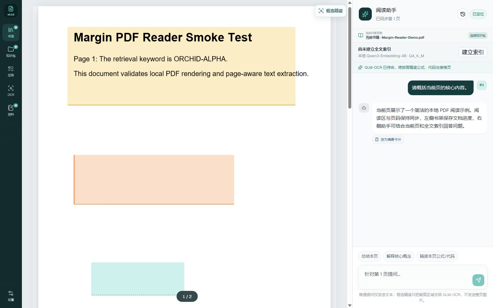
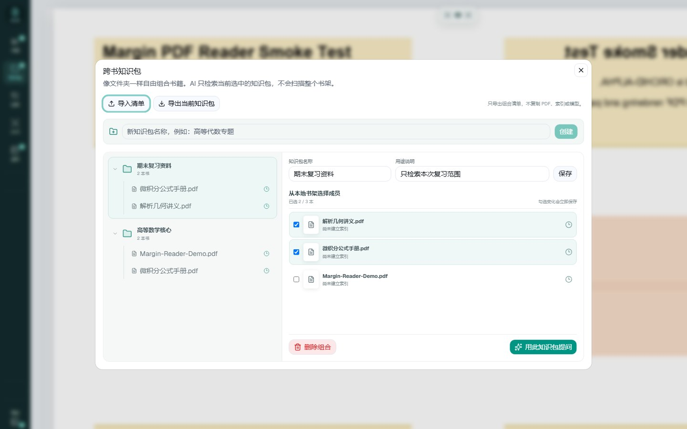
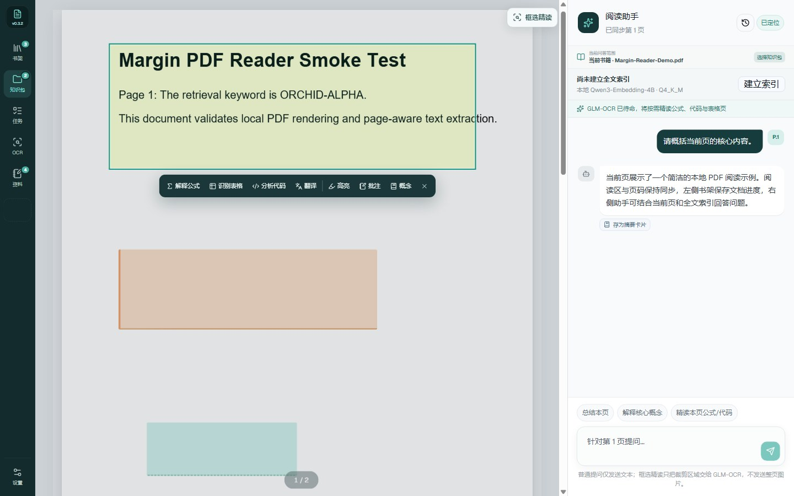
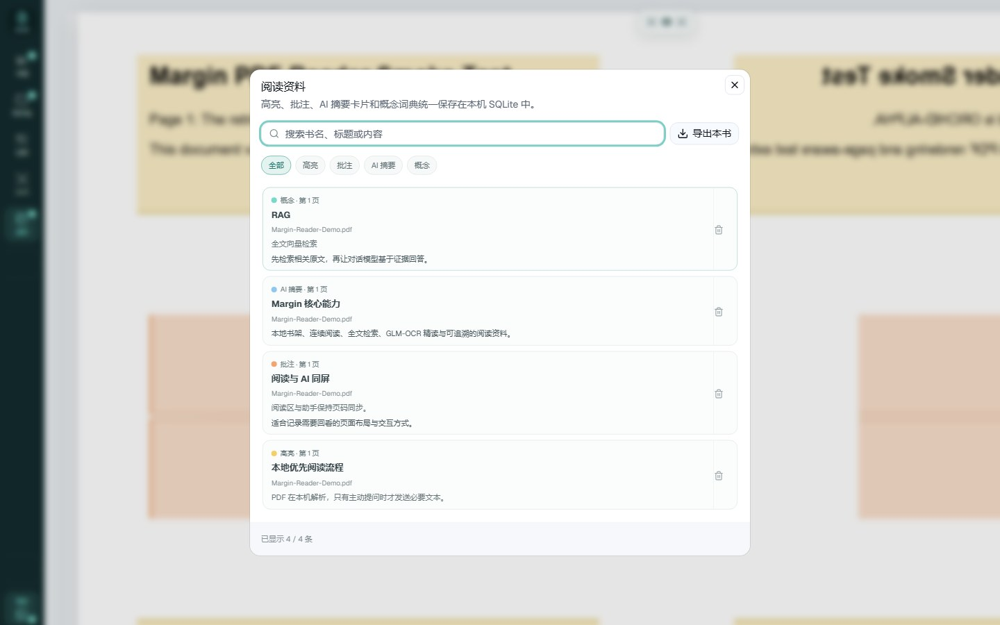
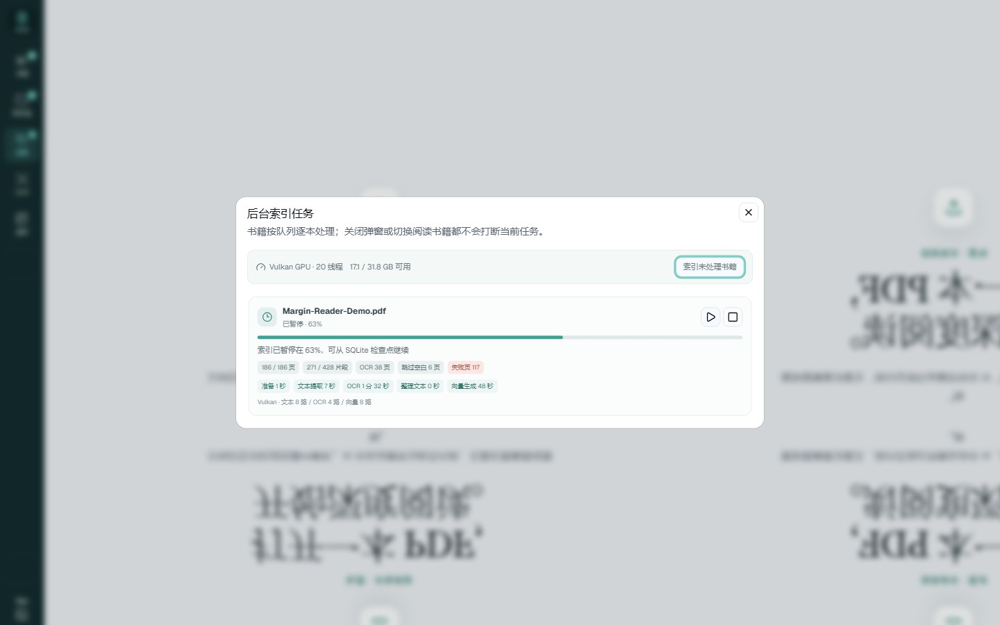
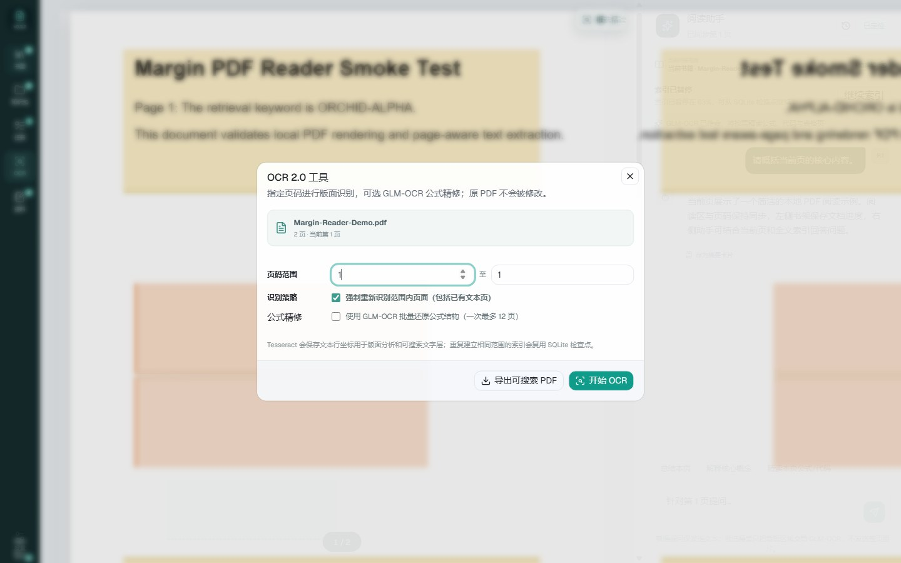
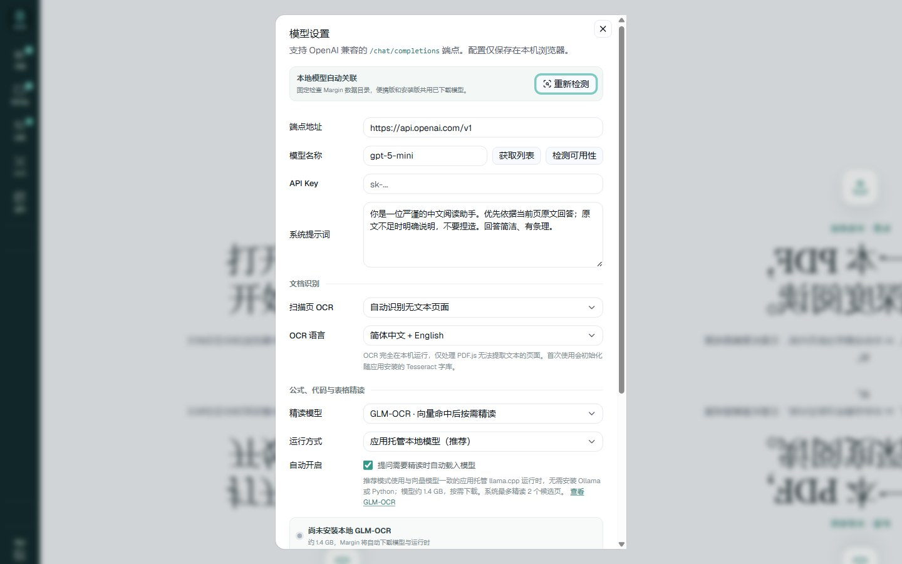

# Margin（页间）

[](https://github.com/Aana11/margin-pdf-reader/actions/workflows/ci.yml)


**Margin 是一个本地优先的 Windows AI PDF 阅读器。**

它把 PDF 阅读、本地书架、跨书知识包、全文检索、公式精读和 AI 问答放在同一个桌面界面里。你可以只读当前页，也可以让 AI 在自己挑选的几本书中寻找证据，再跳回原文核对。



> 截图由仓库内的演示 PDF 和隔离配置生成，不包含真实文档、账号或 API Key。

## 下载

前往 [GitHub Releases](https://github.com/Aana11/margin-pdf-reader/releases/latest) 下载最新版：

- `Margin.Setup.x.x.x.exe`：安装版，适合日常使用。
- `Margin.x.x.x.exe`：便携版，双击即可运行。

目前主要支持 Windows 10/11 x64。程序尚未代码签名，Windows 第一次运行时可能显示 SmartScreen 提示。

## 五分钟开始使用

1. 打开 Margin，点击左侧 **书架 → 导入 PDF**。
2. 点击左下角 **设置**，填写一个兼容 OpenAI `/chat/completions` 的对话模型端点、模型名和 API Key。
3. 打开一本书。此时可以直接询问当前页，不建立索引也能使用。
4. 想检索整本书时，点击助手中的 **建立索引**。首次使用内置向量模型会提示下载模型。
5. 想同时查询多本书时，点击左侧 **知识包**，创建组合、勾选书籍，然后点击 **用此知识包提问**。
6. 页面包含复杂公式、表格或代码时，可在设置中启用 GLM-OCR；也可以点击阅读区右上角 **框选精读**，只识别选中的区域。
7. 扫描书需要精确控制时，点击左侧 **OCR**，指定页码范围重新识别、批量精修公式，或导出带可搜索文字层的 PDF 副本。

PDF、索引、阅读进度、批注和提问历史默认保存在本机。只有你主动提问并使用远程模型时，相关文本或页面裁剪才会发送到所配置的服务。

## 你可以用 Margin 做什么

### 阅读一本书

连续滚动 PDF 时，当前页码会在阅读区下方短暂显示，右侧助手自动跟随页码。直接提问时，Margin 会把当前页文本作为背景；建立索引后，还会补充全书中最相关的片段。

### 同时研究多本书

知识包类似一个只用于检索的文件夹。你决定哪些书可以进入范围，Margin 不会偷偷搜索整个书架。

0.3.1 新增了查询级筛选：提问前可以临时取消某几本书，或只搜索指定页码区间。筛选会在检索前生效，被排除的书和页面不会进入向量扫描或 AI 上下文。



知识包清单还可以导出为 `.margin-pack.json`，在另一台电脑导入后会优先按书籍 ID、其次按唯一同名文件自动关联。清单只保存组合关系，不复制 PDF、索引或模型；没有找到的书会明确列出。

### 精读公式、表格和代码

普通向量检索负责先找到可能相关的页面。启用 GLM-OCR 后，Margin 会从命中结果中选择最多两条公式、表格或代码密集的来源，再读取对应 PDF 页面进行视觉识别。

这个过程现在也适用于跨书知识包。回答会同时保留书名、页码和来源卡片，方便回到原文核对。重复识别同一书籍、页码、任务和模型时会复用会话缓存。



### 留下可回溯的阅读资料

框选页面区域后可以保存高亮、批注或概念词条，不需要启动 AI。AI 回答也能保存为摘要卡片。所有内容都集中在左侧 **资料** 中，可以搜索并跳回原页和原选区。



### 让大型书籍在后台建立索引

一本或多本书可以加入后台队列。切换阅读书籍不会打断任务；暂停、退出或失败后可以从 SQLite 检查点继续，而不是从第一页重来。任务中心会分别显示文本提取、OCR、向量生成和写入耗时。



### 处理扫描书和复杂版面

0.3.2 新增独立的 **OCR 2.0 工具**。可以只处理当前页或手动指定页码范围，也可以强制重新识别已有文本层的页面。Tesseract 会保留文本行、区域类型和页面坐标；同一页的结果写入 SQLite 检查点，后续重建向量索引时可以直接复用。

公式密集的范围可以进一步启用 GLM-OCR 批量精修。为避免一次任务长时间占用模型，单次公式精修限制为 12 页，普通本地 OCR 不受这个限制。



识别完成后可导出新的“可搜索 PDF”副本。Margin 保留原始页面内容，只在副本中按 OCR 坐标加入不可见文字层；原始 PDF 永远不会被覆盖。

## 功能一览

| 功能             | 使用时机                                           |
| ---------------- | -------------------------------------------------- |
| 当前页问答       | 只想询问眼前这一页，不需要先建索引。               |
| 全书向量检索     | 需要在一本长书中寻找相关章节和原始页码。           |
| 跨书知识包       | 需要比较教材、论文或参考资料，又不想检索整个书架。 |
| 书籍与页码筛选   | 临时缩小某次跨书查询的范围。                       |
| GLM-OCR 自动精读 | 命中来源包含公式、表格、代码，文本层还原效果不足。 |
| 页面框选精读     | 只解释、识别或翻译页面上的一小块区域。             |
| 本地 OCR         | 扫描 PDF 没有文字层，需要先生成可检索文本。        |
| 指定范围 OCR     | 只重新识别问题页面，或对已有文本页强制重新识别。   |
| 可搜索 PDF 导出  | 在不修改原件的前提下生成带 OCR 文字层的副本。      |
| 阅读资料与历史   | 保存批注、摘要、概念和对话，并回到原始页面。       |
| Markdown 导出    | 把阅读资料和问答整理到其他笔记软件。               |

AI 回答支持 Markdown、代码块、表格和 KaTeX 公式。可识别 `$...$`、`$$...$$`、`\(...\)` 与 `\[...\]`。

## 模型怎么选

Margin 将模型分成三类，它们各自完成不同工作：

| 模型     | 作用                               | 是否必须                                           |
| -------- | ---------------------------------- | -------------------------------------------------- |
| 对话模型 | 组织最终回答、解释原文             | 使用 AI 问答时必须，由用户配置兼容端点             |
| 向量模型 | 为全书和知识包寻找相关页面         | 只有全文或跨书检索需要，可使用内置 Qwen 或远程端点 |
| GLM-OCR  | 精确读取公式、表格、代码和复杂版面 | 可选，不影响普通阅读与检索                         |



### 对话模型

支持兼容 OpenAI 协议的 `POST /chat/completions`；如果端点提供 `GET /models`，Margin 可以把列表作为同一个模型名称输入框的候选项，仍允许直接填写自定义名称。“检测可用性”会向当前模型发送一个最小请求，检查端点、模型名和凭据是否真的可用。无需鉴权的本地端点可以留空 API Key。系统提示词会作为每次请求的首条 `system` 消息，保存配置后设置页会自动关闭。

### 内置向量模型

本地模式使用 `Qwen/Qwen3-Embedding-4B` 的 Q4_K_M GGUF。首次使用需要下载约 2.5 GB；之后全文片段在本机生成向量。设备资源有限时，也可以改用兼容 `/embeddings` 的远程端点。

### GLM-OCR 精读模型

推荐选择 **应用托管本地模型**。Margin 会自行下载约 1.4 GB 的 GLM-OCR GGUF 和多模态投影器，并使用与向量模型相同的 llama.cpp sidecar 启动方式，不要求安装 Ollama 或 Python。

- 服务只监听随机分配的 `127.0.0.1` 端口。
- 检测到 NVIDIA GPU 时优先使用 Vulkan，否则使用 CPU。
- 自动精读一次最多处理 2 条来源。
- 向量模型与 GLM-OCR 会协调释放 GPU，避免同时长期占用显存。
- 闲置后自动退出，也可以在设置中手动释放内存。

已有 vLLM、SGLang 或 Ollama 服务的用户仍可选择外部兼容端点。使用远程 GLM-OCR 时，候选页图片或手动裁剪区域会发送到该端点。

## 数据与隐私

| 数据                     | 默认保存位置                        | 何时可能发送出去                                   |
| ------------------------ | ----------------------------------- | -------------------------------------------------- |
| PDF、副本和阅读进度      | `%APPDATA%\Margin\library`          | 当前版本不会自动上传 PDF 文件。                    |
| SQLite 向量索引          | 每本书自己的目录                    | 使用远程向量模型时，待嵌入文本会发送到该服务。     |
| OCR 版面坐标             | 每本书的 SQLite 索引                | 本地识别时不会上传；仅主动启用远程精修时发送页面。 |
| 问答、来源、批注和知识包 | `%APPDATA%\Margin\workspace.sqlite` | 不会自动上传。                                     |
| 当前页和检索片段         | 内存                                | 只在主动提问时发送给对话端点。                     |
| GLM-OCR 页面或裁剪       | 当前会话内存                        | 本地托管时不离开设备；远程模式会发送给所选端点。   |
| API Key 和系统提示词     | Electron 浏览器存储                 | Key 只随请求发往对应端点。                         |

> API Key 目前不是存放在独立的加密保险库中。请只在可信的 Windows 账户里使用，并谨慎选择第三方模型服务。

移除书架中的书籍会删除 Margin 管理的 PDF 副本、索引和该书本地阅读数据；原始目录中的 PDF 不受影响。删除知识包只删除组合关系，不会删除书籍。

## 常见问题

### 不配置模型能不能阅读 PDF？

可以。PDF 阅读、书架、阅读进度、高亮和批注不依赖模型。AI 问答需要对话模型；全文检索需要向量模型；GLM-OCR 只是可选的精读能力。

### 为什么知识包里有书被跳过？

通常是尚未建立索引，或者那本书使用的向量模型与当前设置不同。打开知识包管理器可以看到每本书的索引状态。

### 建立索引为什么耗时？

扫描 PDF 需要先逐页渲染并运行 OCR，随后还要生成向量。任务中心会显示当前阶段、并发度和预计剩余时间。暂停不会丢失检查点；只有“取消”才清除未完成索引。

### GLM-OCR 失败后还能回答吗？

可以。自动精读失败会显示具体原因并回退到普通文本检索，不会让整次查询直接失效。可以在设置中检查模型是否下载完整，或打开日志查看详细信息。

### 已经下载模型，为什么软件仍显示未找到？

0.3.2 起安装版和便携版都固定使用 `%APPDATA%\Margin`，不会再因包名差异创建另一套空配置。打开 **设置 → 重新检测** 可以立即重新扫描 Qwen、GLM-OCR 和共享 llama.cpp 运行时，并显示实际模型目录。本机安装版应与 GitHub 最新发行版保持相同版本，版本号同时显示在窗口标题和应用标题中。

### 如何查看运行日志？

打开 **设置 → 运行诊断 → 打开日志目录**。主日志位于 `%APPDATA%\Margin\logs\main.log`。

## 当前限制

- 可搜索文字层通过导出新 PDF 副本生成，不会直接修改或覆盖原 PDF。
- 低清晰度、手写体、复杂多栏和特殊公式仍可能识别不准。
- 自动精读一次最多处理 2 条候选来源，不等同于整书版面分析。
- 知识包导出的是组合清单，不包含 PDF 和索引；导入后需要在本地书架重新关联书籍。
- 当前重点支持 Windows x64，安装包尚未代码签名。
- Margin 不提供内置云对话服务，需要用户自行配置兼容端点和凭据。

## 接下来

- **0.3.3：** 保存检索问题、证据看板、跨书对照阅读和带引用的大纲生成。
- **0.3.4：** 知识点、公式卡片、测验、错题记录与间隔复习。
- **0.3.5：** 本地模型中心 2.0、显存预算、统一任务排队和自动卸载策略。
- **0.3.x：** 继续完善备份迁移、阅读体验、自动化和稳定性。

## 从源码运行

需要 Node.js 22.13 或更高版本，CI 使用 Node.js 24：

```powershell
git clone https://github.com/Aana11/margin-pdf-reader.git
cd margin-pdf-reader
npm install
npm run desktop:dev
```

<details>
<summary>开发、测试与项目结构</summary>

常用命令：

```powershell
npm run lint
npm run lint:electron
npx tsc --noEmit
npm run test:knowledge-packs
npm run build
npm run desktop:release
```

完整测试脚本可以在 `package.json` 中查看。大型书籍结果见 [索引性能基准](docs/index-benchmark.md)，进程、存储和安全边界见 [架构说明](docs/architecture.md)。

```text
app/                 # 阅读器页面与全局样式
components/ui/       # UI 基础组件
electron/            # 桌面主进程、preload、书架与模型 sidecar
lib/rag/             # 文本切分、向量提供商与检索逻辑
lib/indexing/        # 后台任务状态、恢复与 OCR 页面分类
scripts/             # 构建、测试、截图和诊断脚本
types/               # Electron bridge 类型
docs/                # 架构、基准和 README 截图
```

项目采用 GitHub Flow。功能通过独立分支和 Pull Request 合并，版本标签触发 Windows 安装版与便携版构建。贡献约定见 [CONTRIBUTING.md](CONTRIBUTING.md)，版本变化见 [CHANGELOG.md](CHANGELOG.md)。

</details>
