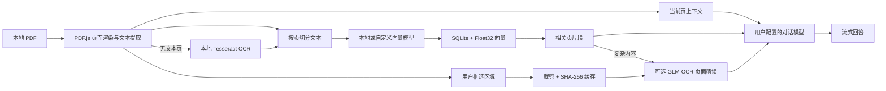

# Margin（页间）

[](https://github.com/Aana11/margin-pdf-reader/actions/workflows/ci.yml)


**Margin 是一个本地优先的 Windows AI PDF 阅读器。**

它把连续阅读、本地书架、阅读进度、页码感知问答、页面框选精读和全文向量检索放在同一个桌面界面里。PDF 在本机解析；只有当你主动提问或框选精读时，相应文本或裁剪区域才会交给你配置的模型。


> 截图使用仓库内的演示 PDF 与隔离配置生成，不包含真实文档、账号或 API Key。

## 为什么做 Margin

普通 PDF 阅读器能展示页面，但阅读过程中经常需要反复复制原文、切换聊天窗口、补充页码背景。Margin 让阅读助手始终知道你正在看的页，并可在本机全文索引中补充相关上下文。

- **少切换：** 阅读区、滚动页码提示和 AI 助手同屏工作。
- **有上下文：** 每次提问自动携带当前页原文；建立索引后还能检索全书相关片段。
- **可接续：** 本地书架记录上次阅读页，问答历史按书籍恢复。
- **可控制：** 对话模型、端点、系统提示词和向量模型都由用户选择。
- **本地优先：** PDF、副本、索引、阅读进度和提问历史默认留在本机。

## 核心功能

| 功能 | 说明 |
| --- | --- |
| 连续 PDF 阅读 | 纵向连续滚动、当前页实时同步；滚动时页码在阅读区底部短暂显示，远离视口的 Canvas 会释放以降低内存占用。 |
| 模块化侧边栏与书架 | 固定 64px 左侧栏承载书架、索引任务和后续功能模块；点击“书架”后通过弹窗导入、打开或移除书籍。PDF、阅读进度和索引均保存在本机。 |
| 当前页问答 | 阅读助手自动附带当前页文本，不需要截图或手动复制。 |
| 全文 RAG | 按页提取文本、切分片段、生成向量并进行余弦相似度检索，结果保留原始页码。 |
| GLM-OCR 联动精读 | 向量检索先定位相关页；Margin 可自行下载 GGUF 模型与多模态投影器并按需启动，无需安装 Ollama 或 Python，vLLM/SGLang 仍可作为外部端点。 |
| 页面框选精读 | 点击阅读区右上角“框选精读”，拖出选区后可直接解释公式、识别表格、分析代码或翻译；只处理裁剪区域，回答引用可跳回原页原位置。 |
| 提问历史 | 问答按书籍保存在本机，可恢复整段对话并跳回当时提问的页面。 |
| 自定义对话模型 | 支持 OpenAI-compatible `/chat/completions` 端点、模型列表读取、流式回答和自定义系统提示词。 |
| 本地向量模型 | 内置 `Qwen/Qwen3-Embedding-4B` Q4_K_M GGUF，提供 2560 维向量，无需把全文交给远程向量服务。 |
| 模型管理 | 应用内完成空间检查、断点续传、暂停/继续、校验、打开目录、释放内存和卸载。 |
| 本地 OCR | PDF.js 无法提取文字时，通过 1–4 路自适应 Tesseract.js worker 池识别扫描页；支持简体中文、繁体中文与英文组合，全程不上传图片。 |
| 后台索引任务中心 | 单本或多本书可加入队列；切换阅读书籍不打断任务，支持暂停、续跑、取消、失败页重试，并展示每阶段耗时、并发度和 CPU/Vulkan 后端。 |
| 可恢复紧凑索引 | SQLite 同时保存 Float32 向量和构建检查点；暂停、退出或失败后可继续，重新换向量模型时可复用兼容的 OCR 文本。 |
| 公式与 Markdown | AI 回答支持 Markdown、代码块、表格，并通过 KaTeX 自动渲染 `$...$`、`$$...$$`、`\(...\)` 与 `\[...\]` 公式。 |
| 运行诊断 | 本地主进程与索引流程写入滚动日志，可从模型设置直接打开日志位置。 |

## 界面导览

主界面由固定功能栏和两个工作区域组成：

1. **左侧功能栏：** “书架”以弹窗管理本地书籍，“任务”集中显示后台索引队列，中间仍预留后续模块，最底部固定为“设置”。
2. **中间阅读区：** 连续展示 PDF 页面，滚动、页码和助手上下文保持同步。
3. **右侧阅读助手：** 建立全文索引、查看历史、使用快捷问题或自由提问。

框选精读适合公式密集、表格错位、代码缩进重要或只想处理一小段内容的页面。选区坐标随问答历史保存，点击回答下方的来源引用即可回到原位置。


大型扫描书可以从书架逐本加入后台队列，也可以一次处理所有未索引书籍。任务中心会分开显示文本提取、OCR、向量生成和 SQLite 写入耗时；暂停会保留检查点，取消才会清除未完成检查点。


模型设置支持独立配置对话模型和向量模型。系统提示词会作为每次对话请求的首条 `system` 消息。


## 工作原理



1. PDF.js 从应用管理的本地 URL 按需读取和渲染页面，而不是把整本 PDF 复制进渲染进程。
2. 书架索引由持久化任务队列逐本调度。根据逻辑处理器和内存使用 2–8 路文本提取；无文本或只有页码等极少文本的页面会先经过图像密度判断，空白页直接跳过，其余页面进入 1–4 路本地 OCR。
3. 内置 Qwen 或自定义 `/embeddings` 端点分批生成向量；Vulkan 使用 8 路推理槽，CPU 保守使用 4 路，界面显示实时吞吐和预计剩余时间。
4. 向量以 Float32 BLOB 保存。查询时主进程流式扫描数据库并只保留 Top-K，避免反序列化巨大的 JSON 数组。
5. 启用 GLM-OCR 后，系统检测命中片段中的公式、代码、表格或明确的“精读”问题，最多把 2 个候选页交给识别模型复核；结果按页码加入上下文并缓存于当前会话。
6. 命中片段、精读结果与当前页原文只在主动提问时发送给对话端点，回答以 SSE 流式显示。
7. 手动框选时只从已经渲染的 Canvas 裁剪选区，最长边限制为 1,800px；GLM-OCR 识别结果按图像哈希与任务缓存，重复选区无需再次运行视觉模型。

索引写入使用临时 SQLite 检查点，进度只会向前增长；中途点击“暂停”、关闭应用或发生错误会保留已提取/OCR 的页面与已生成向量，下次从断点继续。单页 OCR 出错会自动重试一次并记录失败页；“取消”会删除未完成检查点，但不会破坏此前已经完成的索引。完整索引仍在成功后原子替换，旧版 `index.json` 会在首次打开时自动迁移。大型书籍结果见 [索引性能基准](docs/index-benchmark.md)。

更完整的运行边界和约束见 [架构说明](docs/architecture.md)。

## 隐私与本地数据

Margin 的“本地优先”并不代表所有功能都完全离线。数据是否离开设备取决于你配置的模型：

| 数据 | 默认位置 | 何时可能离开设备 |
| --- | --- | --- |
| PDF 原文件与本地副本 | `%APPDATA%\Margin\library` | 当前版本不会自动上传 PDF 字节。 |
| 阅读进度与书架目录 | 本地书籍目录 | 不会自动上传。 |
| 向量索引 | 每本书目录内的 `index.sqlite` | 使用内置 Qwen 时不上传；选择远程向量端点时，待嵌入文本会发送给该服务。 |
| OCR 图片与字库 | 页面图片仅在内存中短暂存在；字库随安装包提供 | OCR 在本机运行，不会发送扫描页。 |
| GLM-OCR 自动精读页 | 当前会话内存 | 默认关闭；使用本机服务时不离开设备，使用远程端点时最多 2 个候选页图片会发送给该服务。 |
| GLM-OCR 手动框选 | 当前会话内存 | 只发送用户框出的 JPEG 裁剪区域；本机托管模式不离开设备，远程模式发送给所选端点。 |
| 当前页与命中片段 | 内存 | 仅在主动提问时发送给配置的对话端点。 |
| 提问历史与系统提示词 | Electron 浏览器存储 | 不会自动上传；历史只在后续提问时作为最近对话上下文发送。 |
| API Key | Electron 浏览器存储 | 仅随请求发送给对应端点；不会进入 Git。 |

> API Key 和历史记录目前依赖 Electron 浏览器存储，并非独立加密保险库。请只在你信任的 Windows 用户账户中使用，并谨慎选择第三方模型服务。

移除书架中的书籍会在确认后删除应用管理的 PDF 副本和索引，同时清除该书对应的本地问答历史。原始 PDF 如果位于其他目录，不受影响。

## 快速开始

### 环境要求

- Windows 10/11 x64
- Node.js 22.13 或更高版本（CI 使用 Node.js 24）
- npm
- 约 3.2 GB 可用空间（使用内置向量模型）；同时安装本地 GLM-OCR 时额外预留约 1.9 GB
- 可选：NVIDIA GPU；检测到后会优先使用 Vulkan 运行时

### 从源码运行

```powershell
git clone https://github.com/Aana11/margin-pdf-reader.git
cd margin-pdf-reader
npm install
npm run desktop:dev
```

应用启动后：

1. 点击左侧“书架”，在弹窗中选择“导入 PDF”。
2. 点击左侧栏最底部“设置”，填写 OpenAI-compatible 对话端点、模型名称和 API Key。
3. 按需调整系统提示词。
4. 按文档选择 OCR 语言；有文本层的页面不会重复识别。
5. 直接针对当前页提问；需要跨页检索时，点击“建立索引”，或在书架里把多本书加入后台队列。
6. 首次使用内置向量模型时，应用会下载并校验模型与 llama.cpp 运行时。
7. 需要精读公式、代码或表格时，启用 GLM-OCR 并点击“下载并安装”；Margin 会自动准备本地模型和共享运行时。升级时若检测到模型已经下载、旧配置又从未明确选择精读开关，会自动关联并启用按需启动。
8. 点击阅读区右上角“框选精读”，在页面上拖框，选择“解释公式”“识别表格”“分析代码”或“翻译”。

## 模型配置

### 对话模型

对话端点需要兼容：

- `GET /models`：可选，用于“自动获取模型列表”。
- `POST /chat/completions`：必需，支持标准 JSON；支持 SSE 时可流式显示。

Margin 不绑定单一厂商。只要服务遵循兼容协议，就可以填写自己的端点、模型名和 Key。自定义系统提示词只影响对话，不会导致已有向量索引失效。

### GLM-OCR 精读模型（可选）

[GLM-OCR](https://github.com/zai-org/GLM-OCR) 是面向复杂文档的 0.9B 多模态识别模型。Margin 不会在索引阶段用它逐页扫描，而是先用向量模型召回相关片段，再根据公式、代码、表格特征或用户明确的精读请求选择最多 2 页，通过页面图像执行二次识别。这样既保留跨页语义检索，也避免大书每页都运行视觉模型。

在“模型设置 → 公式、代码与表格精读”中启用 GLM-OCR。推荐模式与内置向量模型使用同一种启动方式：

```text
运行方式：应用托管本地模型（推荐）
模型：ggml-org/GLM-OCR-GGUF（Q8_0）
运行时：Margin 托管的 llama.cpp sidecar
```

点击“下载并安装”后，Margin 会断点下载并校验约 1.4 GB 的 GLM-OCR GGUF 主模型与多模态投影器，并自动准备固定版本的 llama.cpp。模型只监听随机分配的 `127.0.0.1` 端口；开启“自动开启”后，提问命中复杂页面时自动载入，闲置 5 分钟或手动释放后退出。向量模型与精读模型不会同时占用 GPU，切换时会先释放另一个 sidecar。

0.2.8 起，应用启动时会从固定的 `%APPDATA%\Margin` 数据目录发现已经下载的 Qwen、GLM-OCR 与运行时。旧版配置里没有明确记录精读开关时，完整的本地模型会自动关联到“应用托管”模式；如果你曾明确选择“关闭”，Margin 会尊重该设置，不会自行打开。

也可选择外部 OpenAI-compatible 模式，填写官方支持的 vLLM/SGLang 服务，例如 `http://127.0.0.1:8080/v1` 与模型名 `glm-ocr`；已有 Ollama 用户仍可在高级选项连接本机服务。Margin 不把 GLM-OCR 权重打进安装包，远程端点在自动精读时会收到最多 2 个候选页图片，在手动框选时只收到裁剪区域。精读失败会显示“运行时未准备 / 模型未下载 / 端点超时”等具体原因，并自动回退普通检索。

手动框选不依赖全文索引：Margin 直接裁剪当前 Canvas，并根据所选动作调用 GLM-OCR 的公式、表格或文本识别任务；识别结果再交给对话模型解释或整理。裁剪图最长边为 1,800px，同一图片、任务和模型配置的结果以 SHA-256 缓存在当前会话。问答记录保存页码与归一化选区坐标，但不把裁剪图片写入历史。

### 向量模型

有两种模式：

| 模式 | 适用场景 | 代价 |
| --- | --- | --- |
| 本地 Qwen3-Embedding-4B | 不希望把整本书的片段发送到远程向量服务 | 首次下载约 2.5 GB，索引时需要本机算力和内存。 |
| OpenAI-compatible `/embeddings` | 设备资源有限，或已有向量服务 | 文本片段会发送给所选服务，并可能产生费用。 |

内置模型固定使用官方 `Qwen3-Embedding-4B-Q4_K_M.gguf`，下载顺序为 Hugging Face → ModelScope → Hugging Face 国内镜像，并校验 SHA-256。模型默认安装到：

```text
%APPDATA%\Margin\models\Qwen\Qwen3-Embedding-4B-GGUF
```

llama.cpp 仅监听 `127.0.0.1`。检测到 NVIDIA GPU 时应用选择固定版本的 Vulkan 运行时，否则使用 CPU 运行时；可通过环境变量强制后端：

```powershell
$env:MARGIN_RUNTIME_BACKEND = "cpu"     # 或 "vulkan"
npm run desktop:dev
```

模型只在生成向量时载入，空闲 2 分钟后会自动退出，也可以在模型设置中手动“释放内存”。

## 本地目录

默认数据根目录为 `%APPDATA%\Margin`：

```text
Margin/
├─ library/                 # 每本书的 PDF、元数据与 index.sqlite
├─ models/                  # 下载的 GGUF 模型
├─ runtime/llama/           # llama.cpp CPU 或 Vulkan 运行时
├─ downloads/               # 可续传、可校验的下载文件
├─ ocr/                     # 开发模式 OCR 缓存（发行版字库随程序提供）
└─ logs/main.log            # 本地主进程与索引诊断日志
```

开发和诊断时可使用 `MARGIN_DATA_ROOT` 或 `MARGIN_LIBRARY_ROOT` 指向隔离目录。

## 开发命令

| 命令 | 用途 |
| --- | --- |
| `npm run dev` | 启动 Web 渲染层开发服务器。 |
| `npm run desktop:dev` | 同时启动开发服务器与 Electron。 |
| `npm run build` | 构建静态桌面渲染资源。 |
| `npm run desktop:pack` | 构建并生成未安装的 Windows 应用目录。 |
| `npm run desktop:release` | 生成 NSIS 安装包与便携版，不捆绑本地模型。 |
| `npm run model:bundle` | 下载并校验本地 Qwen 与 llama.cpp 资源。 |
| `npm run lint` | 检查前端、RAG 与脚本代码。 |
| `npm run lint:electron` | 检查 Electron 主进程和 preload 语法。 |
| `npm run test:desktop` | 使用真实两页 PDF 验证导入、滚动、书架、历史与设置持久化。 |
| `npm run test:desktop:embedding` | 在桌面冒烟测试基础上执行真实 2560 维本地向量与索引验证。 |
| `npm run test:ocr` | 对真实页面截图执行本地中英文 OCR 快速测试。 |
| `npm run test:desktop:ocr` | 用无文本层扫描 PDF 验证 OCR → 嵌入 → SQLite → 检索完整链路。 |
| `npm run test:deep-reading` | 验证复杂内容分类、向量候选页选择和 GLM-OCR 多模态请求格式。 |
| `npm run test:desktop:deep-reading` | 对打包应用验证向量召回 → 页面渲染 → GLM-OCR → 对话上下文完整联动。 |
| `npm run test:region-reading` | 验证选区归一化、像素裁剪边界、缩放上限、任务路由与哈希稳定性。 |
| `npm run test:desktop:region-reading` | 对打包应用验证真实拖框、选区上传、重复识别缓存、公式渲染与引用回跳。 |
| `npm run test:index-tasks` | 验证任务持久化、异常退出恢复和 OCR 页面分类。 |
| `npm run test:desktop:model-association` | 对打包应用验证已下载 Qwen/GLM-OCR 自动关联，并确认手动关闭不会被覆盖。 |
| `npm run test:desktop:managed-glm` | 下载并启动真实的应用托管 GLM-OCR，对生成的公式图片执行本地识别；模型保存在 Margin 数据目录。 |
| `npm run benchmark:index` | 对比大型书籍 JSON 与 SQLite/Float32 索引的体积、写入和查询。 |
| `npm run diagnose:library-index -- <书名片段>` | 对本地书架中的指定书籍执行可观察的索引诊断。 |
| `npm run docs:screenshots` | 使用隔离的演示数据重新生成 README 截图。 |

提交前建议运行：

```powershell
npm ci
npm run lint
npm run lint:electron
npx tsc --noEmit
npm run test:ocr
npm run test:deep-reading
npm run build
```

## 项目结构

```text
app/                 # 阅读器页面与全局样式
components/ui/       # UI 基础组件
electron/            # 桌面主进程、preload、书架与模型 sidecar
lib/rag/             # 文本切分、向量提供商与内存索引
lib/indexing/        # 后台任务状态、恢复与 OCR 页面分类
scripts/             # 构建、模型下载、桌面测试和诊断工具
types/               # Electron bridge 与资源类型
docs/                # 架构说明和 README 截图
```

## 已知限制

- **OCR 不是版面还原：** 低清晰度、手写体、复杂多栏和特殊公式可能识别不准；OCR 文本用于助手上下文与检索，不会叠加为 PDF 可选文字层。
- **GLM-OCR 模型按需下载：** 模型不随安装包分发；推荐模式无需安装额外软件，但首次使用需下载约 1.4 GB。已下载模型可以自动关联，自动模式一次最多精读 2 页，不等同于整书布局解析。
- **框选坐标基于 PDF 页面比例：** 缩放或重新打开后仍能回到对应区域，但当前版本不生成可编辑的 OCR 文字层，也不保存裁剪图片。
- **当前仅重点支持 Windows：** 构建、原生运行时和桌面冒烟测试均面向 Windows x64。
- **尚未代码签名：** 本地构建的安装包可能触发 Windows SmartScreen 提示。
- **暂未提供内置云模型：** 对话能力需要用户自行配置兼容端点和凭据。

## 路线图

- 0.2.9：笔记、高亮和框选结果收藏，支持页码引用与 Markdown 导出。
- 0.3.0：跨书检索与知识库问答，在测量数据量达到阈值后引入近似最近邻索引。
- 0.3.1：OCR 版面分析、手动页范围、公式批量精修与可选文字层导出。
- 持续完善历史搜索、应用图标、代码签名、更新体验和更细粒度的数据清理。

## 参与开发与发布

项目使用 GitHub Flow：功能在独立分支完成，通过 Pull Request 检查和评审后再合并到 `main`。详细约定见 [CONTRIBUTING.md](CONTRIBUTING.md)。

推送 `vX.Y.Z` 标签会先执行静态检查和 OCR 测试，再构建 Windows 安装版与便携版并发布 GitHub Release。产物包含 OCR 引擎和中英文字库，但不捆绑约 2.5 GB 的向量模型。版本变化见 [CHANGELOG.md](CHANGELOG.md)。
